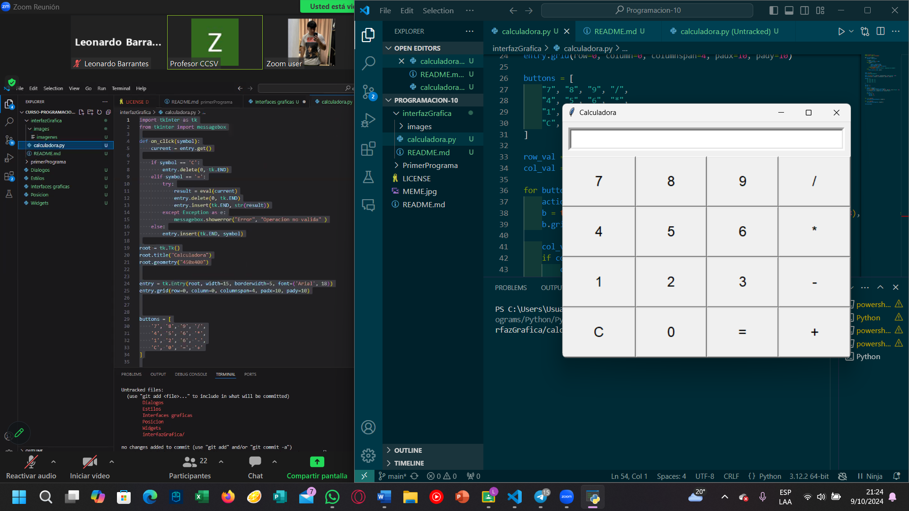

# Interfaz gráfica Tkinter 

En el presente directorio, se utilizo el módulo Tkinter para crear una interfaz gráfica para una calculadora.

(Explicacion)

## Instruciones de uso

¿Qué hay que tener instalado para ejecutar el programa? ¿Qué comando utilizar?

```
py calculadora.py
```

## Demostracion de ejecución 

<p align="center">
  
</p>